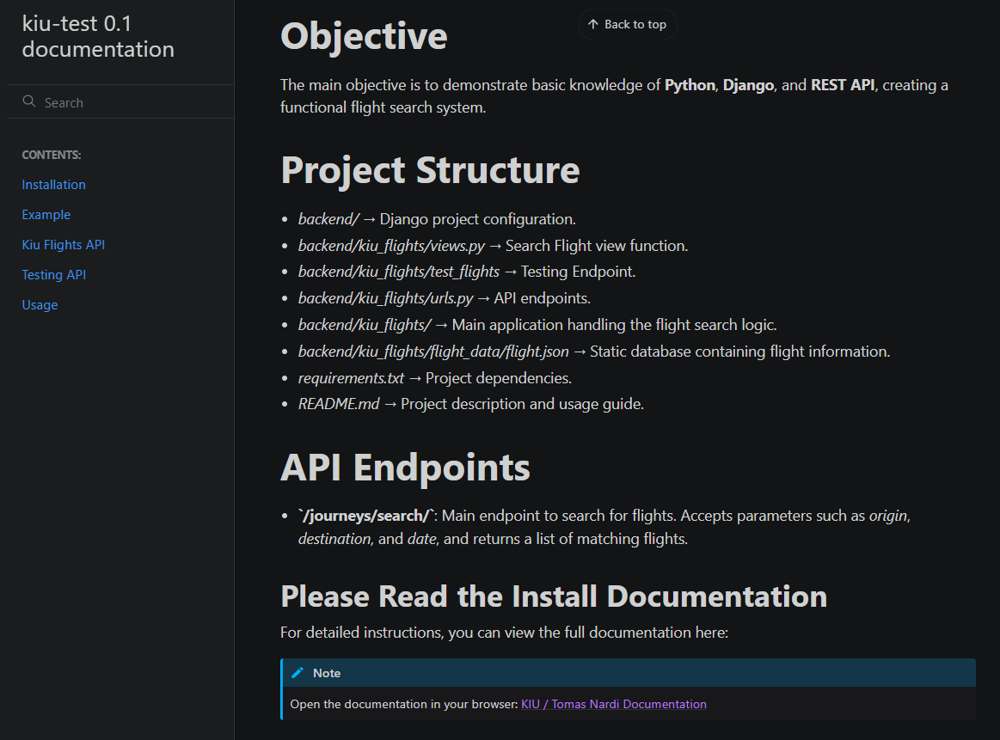

# Kiu Flights API - Junior Python Challenge

Welcome!
This backend service lets you search, manage, and explore flight information with ease.

---

## Installation
Getting started is easy! Follow these steps to have the project running locally and browse the full documentation.

1. Clone the repository

```bash
git clone https://github.com/TomasNardi/Kiu-tomas-nardi
cd Kiu-tomas-nardi
```

2. Create and activate a virtual environment

```bash
# Linux / Mac
python -m venv .venv
source .venv/bin/activate
# Windows
python -m venv .venv
.venv\Scripts\activate
```

3. Install dependencies

```bash
pip install -r requirements.txt
```

4. Open the documentation locally

```bash
cd docs/build/html
# Windows
start index.html
# Mac
open index.html
# Linux (most distributions)
xdg-open index.html
```

---
## 📖 Usage



After installation, you can start the API server and begin making requests to search and manage flight information.

---

## Plus (Backend and Frontend Deployment)

For the technical challenge, I also set up two servers: the one requested by the interviewers and a responsive React front-end.
The backend service was deployed on Render, and the front-end on Vercel.
Since it’s already live, I cloned the repository and configured it in another repo, which I can provide if needed.

Usage link: https://kiu-front.vercel.app/


Api Response in Production 


